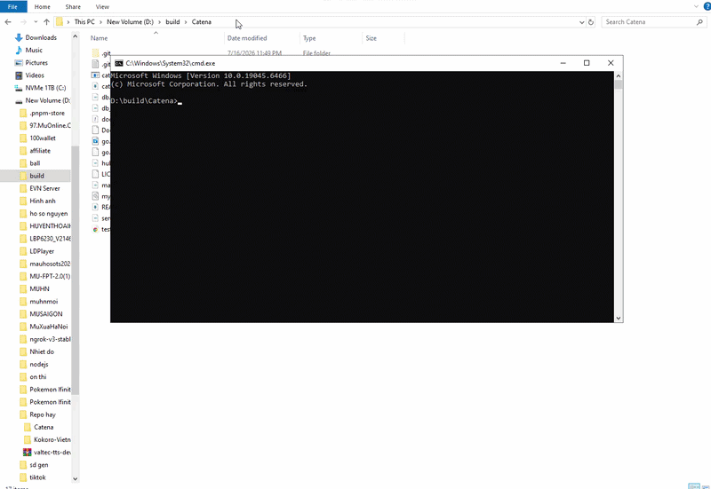

# Catena

[](https://github.com/catena-db/catena/actions/workflows/ci.yml)

**Turn any SQLite file into a realtime HTTP and WebSocket API.**

Catena sits in front of a normal SQLite file and gives it a network API: run parameterized SQL over HTTP, receive realtime table update events over WebSocket, inspect it from an embedded admin UI, and export or back it up when needed.

```text
SQLite file -> instant HTTP + WebSocket API
```



## Why Catena?

SQLite is excellent for local-first apps, internal tools, edge devices, prototypes, and small services. The missing piece is often a simple way to let another process, browser, device, or script talk to that same SQLite file without embedding a driver everywhere.

Catena provides that missing layer:

- Keep your real `.db` file.
- Start one binary.
- Talk to it with HTTP and WebSocket.
- Use SQL directly, with parameters.
- Keep writes serialized and reads concurrent through SQLite WAL mode.

Long-term, Catena aims to make SQLite files instantly usable as APIs: local, self-hosted, edge-hosted, or cloud-hosted.

## Use Cases

Catena works best when you want a small network API in front of a real SQLite file:

- Edge and IoT data hubs.
- Internal tools and operational dashboards.
- Local-first app sync nodes.
- POS and inventory systems.
- Lab, field, and scientific data collection.
- Read-only public SQLite datasets.
- Automation backends for PowerShell, Python, and Node scripts.
- Embedded admin backend for desktop apps.
- Lightweight analytics databases for small teams.
- Prototype backends before you need a larger database server.

## Features

- Single binary server written in Go.
- Pure Go SQLite driver via `modernc.org/sqlite`.
- WAL mode for concurrent reads.
- Serialized write path to reduce SQLite writer contention.
- `POST /query` for one parameterized SQL statement.
- `POST /transaction` for atomic write batches.
- `GET /ws` for realtime table update events.
- API key authentication.
- Read-only mode.
- Configurable CORS, body limit, query timeout, and rate limit.
- Database export and server-side backup endpoints.
- Process-local JSON metrics.
- Embedded admin UI at `/`.
- OpenAPI document at `/openapi.json`.
- Minimal JavaScript and Python clients in `sdk/`.
- Docker and GitHub Actions release builds.

## Install

Download the latest binary from GitHub Releases, or build from source:

```bash
go build -o catena
```

Check the binary:

```bash
./catena version
```

On Windows:

```powershell
.\catena.exe version
```

## Quick Start

Start Catena with an API key:

```bash
./catena serve --db dev.db --host 127.0.0.1 --port 8080 --api-key dev-secret
```

On Windows:

```powershell
.\catena.exe serve --db dev.db --host 127.0.0.1 --port 8080 --api-key dev-secret
```

Open the admin UI:

```text
http://127.0.0.1:8080
```

Enter the API key:

```text
dev-secret
```

## 3-Minute Demo

Health check:

```bash
curl http://127.0.0.1:8080/health
```

Create a table:

```bash
curl -X POST http://127.0.0.1:8080/query \
  -H "Content-Type: application/json" \
  -H "Authorization: Bearer dev-secret" \
  -d '{"sql":"CREATE TABLE IF NOT EXISTS notes (id INTEGER PRIMARY KEY AUTOINCREMENT, title TEXT, done INTEGER DEFAULT 0, created_at TEXT DEFAULT CURRENT_TIMESTAMP)"}'
```

Insert a row:

```bash
curl -X POST http://127.0.0.1:8080/query \
  -H "Content-Type: application/json" \
  -H "Authorization: Bearer dev-secret" \
  -d '{"sql":"INSERT INTO notes (title) VALUES (?)","params":["Test Catena"]}'
```

Read rows:

```bash
curl -X POST http://127.0.0.1:8080/query \
  -H "Content-Type: application/json" \
  -H "Authorization: Bearer dev-secret" \
  -d '{"sql":"SELECT * FROM notes ORDER BY id DESC","params":[]}'
```

Subscribe to realtime events from the admin UI, set the realtime table to `notes`, then insert another row. You will receive an event like:

```json
{
  "type": "update",
  "table": "notes",
  "operation": "insert",
  "rows_affected": 1,
  "timestamp": "2026-07-25T12:00:00Z"
}
```

## API

Catena exposes a small API surface:

| Endpoint | Method | Purpose |
| --- | --- | --- |
| `/health` | `GET` | Server health and version |
| `/query` | `POST` | Execute one SQL statement |
| `/transaction` | `POST` | Execute multiple write statements atomically |
| `/ws` | `GET` | WebSocket table update subscriptions |
| `/export` | `GET` | Download a checkpointed SQLite database copy |
| `/backup` | `POST` | Create a server-side backup |
| `/metrics` | `GET` | Return JSON runtime metrics |
| `/openapi.json` | `GET` | OpenAPI document |

Authenticated requests use:

```text
Authorization: Bearer <api-key>
```

or:

```text
X-API-Key: <api-key>
```

WebSocket clients can also use:

```text
ws://127.0.0.1:8080/ws?token=dev-secret
```

### Query

Read query:

```bash
curl -X POST http://127.0.0.1:8080/query \
  -H "Content-Type: application/json" \
  -H "Authorization: Bearer dev-secret" \
  -d '{"sql":"SELECT name FROM sqlite_master WHERE type = ?","params":["table"]}'
```

Write query:

```bash
curl -X POST http://127.0.0.1:8080/query \
  -H "Content-Type: application/json" \
  -H "Authorization: Bearer dev-secret" \
  -d '{"sql":"INSERT INTO notes (title) VALUES (?)","params":["Hello"]}'
```

Catena allows one SQL statement per request. Multi-statement request bodies are rejected by default.

### Transaction

`/transaction` accepts write statements and commits them as one SQLite transaction:

```bash
curl -X POST http://127.0.0.1:8080/transaction \
  -H "Content-Type: application/json" \
  -H "Authorization: Bearer dev-secret" \
  -d '{
    "statements": [
      { "sql": "INSERT INTO notes (title) VALUES (?)", "params": ["Batch A"] },
      { "sql": "INSERT INTO notes (title) VALUES (?)", "params": ["Batch B"] }
    ]
  }'
```

If any statement fails, Catena rolls back the transaction.

### Backup, Export, Metrics

Download the current database:

```bash
curl -L http://127.0.0.1:8080/export \
  -H "Authorization: Bearer dev-secret" \
  -o catena-export.db
```

Create a server-side backup:

```bash
curl -X POST http://127.0.0.1:8080/backup \
  -H "Authorization: Bearer dev-secret"
```

Read metrics:

```bash
curl http://127.0.0.1:8080/metrics \
  -H "Authorization: Bearer dev-secret"
```

Error responses use a stable shape:

```json
{
  "code": "invalid_sql",
  "message": "multiple SQL statements are disabled",
  "details": ""
}
```

## Admin UI

The embedded admin UI is available at `/`.

It includes:

- API key input.
- SQL query runner.
- SELECT result table rendering.
- WebSocket realtime event log.
- Metrics button.
- Backup button.
- Export button.

No separate frontend build is required.

## CLI

Start the server:

```bash
./catena serve --db dev.db --port 8080 --api-key dev-secret
```

Print version:

```bash
./catena version
```

Create a starter config file:

```bash
./catena init-config --output catena.yaml
```

Inspect a database:

```bash
./catena inspect --db dev.db
```

Example inspect output:

```json
{
  "path": "dev.db",
  "size_bytes": 12288,
  "journal_mode": "wal",
  "user_version": 0,
  "table_count": 1,
  "tables": ["notes"]
}
```

## Configuration

CLI flags:

```text
--db              SQLite database path
--host            interface to bind to
--port            HTTP port
--api-key         require an API key for /query, /transaction and /ws
--readonly        reject write statements
--cors-origin     Access-Control-Allow-Origin value
--body-limit      maximum JSON request body size in bytes
--query-timeout   maximum query duration
--rate-limit      per-client requests per minute; 0 disables rate limiting
--backup-dir      directory for database backups
```

Example `catena.yaml`:

```yaml
db: "production.db"
host: "0.0.0.0"
port: 8080
api_key: "change-me"
readonly: false
cors_origin: "https://example.com"
body_limit: 1048576
query_timeout: "30s"
rate_limit: 120
backup_dir: "backups"
```

Environment variables use the `CATENA_` prefix:

```bash
CATENA_DB=production.db
CATENA_API_KEY=change-me
CATENA_PORT=8080
```

## Docker

Build and run:

```bash
docker build -t catena .
docker run --rm -p 8080:8080 -v ./data:/app/data catena
```

Docker Compose:

```bash
docker compose up -d
```

## SDKs

JavaScript:

```js
import { CatenaClient } from "./sdk/catena.js";

const catena = new CatenaClient("http://127.0.0.1:8080", {
  apiKey: "dev-secret",
});

const result = await catena.query("SELECT * FROM notes");
catena.subscribe("notes", console.log);
```

Python:

```python
from sdk.catena import CatenaClient

catena = CatenaClient("http://127.0.0.1:8080", api_key="dev-secret")
print(catena.query("SELECT * FROM notes"))
```

The SDKs are intentionally small reference clients. Package publishing is planned for a later release.

## When To Use Catena

Catena is a good fit when you want:

- A tiny backend in front of a SQLite file.
- HTTP access from scripts, browsers, mobile apps, or edge devices.
- Realtime table update notifications.
- A local admin UI without running a separate frontend.
- Internal tools, prototypes, demos, and local-first app infrastructure.
- A self-hosted server that keeps SQLite as the source of truth.

## When Not To Use Catena

Catena is not the right tool when you need:

- A full backend framework with users, collections, storage, and auth flows.
- Multi-node consensus or distributed database replication.
- Fine-grained row-level permissions.
- A public SQL endpoint without a trusted security boundary.
- PostgreSQL/MySQL compatibility.
- A managed database service.

## Comparison

| Project | Similarity | Difference |
| --- | --- | --- |
| PocketBase | Single binary, SQLite, realtime, admin UI | Full backend framework; Catena is a smaller SQLite-over-HTTP layer |
| rqlite | SQLite over HTTP | Distributed/consensus database; Catena serves one SQLite file simply |
| Datasette | Publishes SQLite through web/API | Data publishing and exploration; Catena focuses on read/write API and realtime |
| Soul | SQLite REST and realtime | Catena is Go single-binary with raw SQL endpoint and WAL/write serialization |
| LiteFS | SQLite production infrastructure | Replication/filesystem layer; Catena is an HTTP/WebSocket API server |

## Production Notes

Catena v0.3.0 is a developer MVP and local production candidate. For public or important deployments:

- Use a strong API key.
- Set a strict `--cors-origin`.
- Run behind a reverse proxy with TLS.
- Enable rate limiting.
- Use `--readonly` for public read-only data.
- Back up regularly.
- Avoid exposing raw SQL to untrusted users.
- Monitor `/metrics`.

See `docs/PRODUCTION.md` for systemd, Docker Compose, reverse proxy, backup, and security guidance.

## Release Builds

Build cross-platform release binaries locally:

```powershell
.\scripts\build-release.ps1 -Version 0.3.0
```

Artifacts and `SHA256SUMS.txt` are written to `dist/`.

GitHub Actions also builds and publishes release artifacts automatically when a tag matching `v*` is pushed. See `docs/RELEASE_CHECKLIST.md` for the release process.

## Roadmap

Planned work:

- GitHub issue templates.
- Benchmarks for read/write latency and concurrent clients.
- Audit log for write statements.
- Separate read/write/admin API keys.
- Backup retention policy.
- Better SQL parsing for table event detection.
- Packaged npm and Python clients.
- More production deployment examples.

Use GitHub Issues for bug reports, feature requests, documentation feedback, and production deployment questions. The repository includes issue templates to keep reports actionable.

## License

MIT
